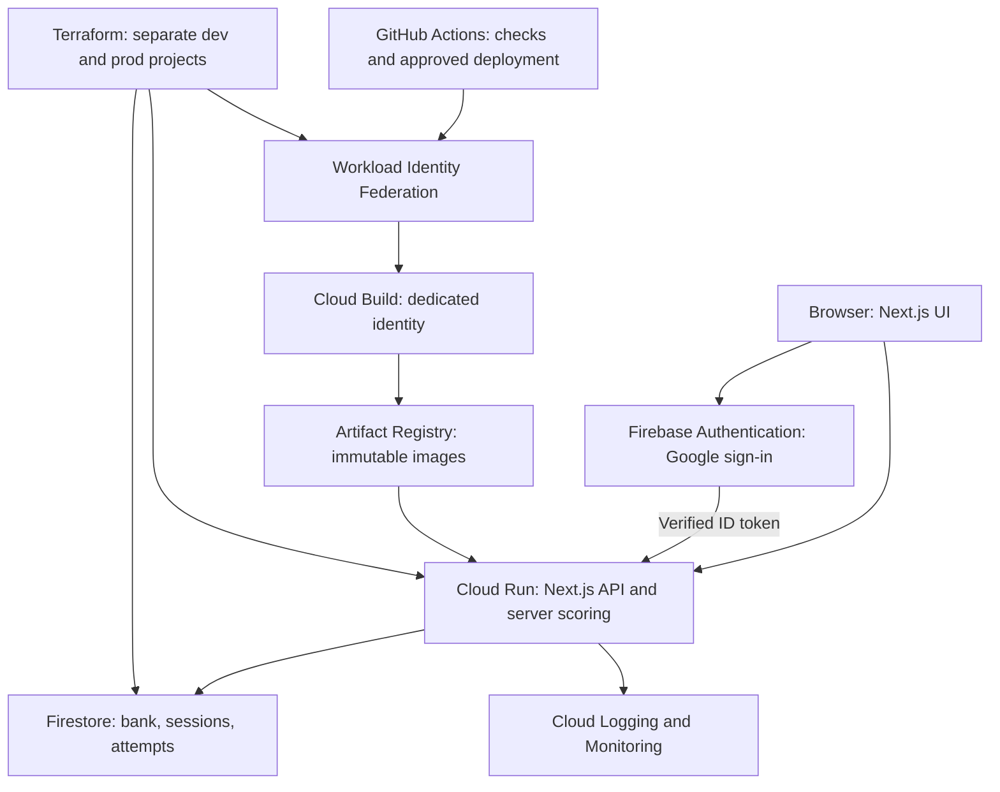

# GCP ACE Practice Lab

A Google Cloud Associate Cloud Engineer study platform and a practical cloud engineering portfolio project by **Khalid Hashim**. Built with Next.js, TypeScript and Tailwind CSS; designed for Cloud Run with keyless CI/CD and Terraform-managed infrastructure.

> **Honest study results:** the supplied PDF has 81 questions and no answer key. All imported questions are **ungraded**. The app tracks completion without inventing scores. Only questions with a verified key, explanation, and official reference contribute to scores.

## What you can do

- Practice by topic or take a randomized, 120-minute, 81-question mock exam.
- Select single or multiple answers, navigate freely, and flag questions.
- Track question coverage and completed attempts; review selections and topic results.
- Filter verified incorrect answers and read official references when keys are added.
- Switch between responsive light and dark interfaces.
- Import, validate and edit the bank through the protected admin JSON editor.
- Run locally without a Google account or cloud credentials.

## Architecture



No load balancer, NAT gateway, GKE cluster, or continuously running VM. Cloud Run uses zero minimum instances, request-based CPU and a maximum of two instances. Region defaults to `me-central1` (Doha). Firebase Authentication and Workload Identity pools are global services.

## Technology stack

| Layer                        | Technology                                                     |
| ---------------------------- | -------------------------------------------------------------- |
| UI and API                   | Next.js App Router, React, TypeScript                          |
| Styling                      | Tailwind CSS 4 and semantic CSS tokens                         |
| Validation / testing         | Zod, Vitest, Playwright                                        |
| Local persistence            | JSON question bank and isolated filesystem attempt records     |
| Cloud persistence / identity | Firestore, Firebase Authentication, Admin SDK                  |
| Runtime / delivery           | Docker, Cloud Run, Artifact Registry, Cloud Build              |
| Infrastructure / credentials | Terraform, GitHub OIDC and Workload Identity Federation        |
| Operations                   | Structured error logs, health endpoint, log-based alert policy |

## Local installation

Use Node.js 22 and npm. From the repository root:

```bash
npm ci
cp .env.example apps/web/.env.local
npm run dev
```

Open `http://localhost:3000`. No Google Cloud credentials are required. Local mode uses one development identity with admin access and stores attempts in `apps/web/.local/`. This mode is deliberately rejected when serving production API requests. `npm run build` works without cloud credentials because Firebase initialization happens only during a cloud request.

```bash
npm run validate:questions
npm run lint
npm run typecheck
npm test
npm run build
```

The cloud production server requires `DATA_MODE=firestore`, Firebase web configuration and Application Default Credentials supplied by its runtime service account. See [deployment guide](docs/deployment.md).

## Repository map

| Directory / file                | Purpose                                                          |
| ------------------------------- | ---------------------------------------------------------------- |
| `apps/web/app`                  | Dashboard, exam UI, admin editor and server API routes           |
| `apps/web/lib`                  | Validated schema, pure exam logic, auth and persistence adapters |
| `data`                          | Original ungraded questions and source provenance                |
| `scripts`                       | Import validation, reproducible extraction, admin role setup     |
| `tests`                         | Scoring, selections, time logic and API integration tests        |
| `e2e`                           | Browser workflow smoke tests                                     |
| `infra/modules/platform`        | Reusable Google Cloud platform module                            |
| `infra/environments/{dev,prod}` | Isolated environment configurations                              |
| `infra/bootstrap`               | Protected, versioned Terraform state bucket                      |
| `.github/workflows`             | CI checks and manually approved cloud delivery                   |
| `docs`                          | Architecture, deployment, security, cost and verification notes  |

## Question integrity

The import preserves question wording and A-D choices, collapsing PDF line wrapping into spaces. Questions 52 and 73 require two selections. Topic labels are heuristic editorial metadata and can be corrected through the admin editor. Source provenance includes the uploaded PDF SHA-256. The PDF itself is not redistributed in this repository.

Public quiz responses exclude keys, explanations and references. The server snapshots a bank when an exam starts and grades that version on submission. Admin imports are validated before storage. Add verified keys through the cloud admin editor; **do not commit private answer keys to this public repository**. Explanations and keys become available to that user after submission for study review.

## Deployment and operations

- [Deployment and Firebase setup](docs/deployment.md)
- [Architecture and tradeoffs](docs/architecture.md)
- [Security model](docs/security.md)
- [Cost controls and cleanup](docs/cost.md)
- [Validation report and known limits](docs/verification.md)

The deploy workflow is manual. Configure GitHub `dev` and `prod` environments and required reviewers for `prod` before granting federation access. Infrastructure provisioning and public exposure are separate, explicitly approved actions. No cloud deployment is claimed as tested by this repository's creation.

## Portfolio value

This project demonstrates full-stack delivery, IAM separation, server-side authorization, Terraform modules, secure remote state, immutable container deployment, keyless CI/CD, observability, and cost-aware serverless architecture. It also demonstrates an engineering decision to keep scoring unavailable until the source answers can be verified.

[Portfolio](https://khalidhashim.com)

## License

Project code is MIT licensed. The imported exam content is user-provided; its original ownership is not established by the code license. This is an independent learning project and is not affiliated with or endorsed by Google.
